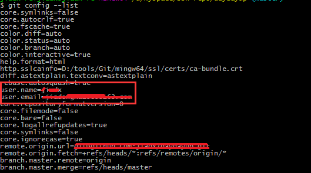
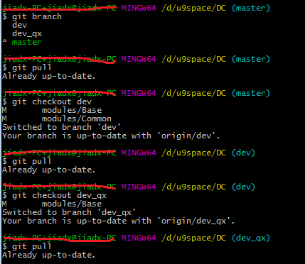

##  git  服务迁移（保留所有提交记录）
### 一、生成ssh公钥并添加公钥到代码库
1.  通过git config --list 查看配置文件中user.name和user.email

    

2.  假如这两项没有配置，使用命令配置(如果有两项配置,则跳过此步骤)
    ```
    $ git config --global user.name "自己的名字"
    $ git config --global user.email "自己的邮箱"
    ```

3.  生成公钥
    找到.ssh文件（win在C盘的用户下;mac和Linux在登录用户下  cd ~/.ssh）
    执行命令ssh-keygen  (一定在.ssh目录先执行此命令)
    一直按enter即可生成。

    

    如图，使用编辑器打开id_rsa.pub，复制，将其里边的内容发给管理员，格式保持一致。例如：  
    name:jiadx  
    key:具体的串儿

### 二、本地仓库更改  (以DC为例)
1.  保证本地库的版本号不晚于原服务器版本  
  
    操作如下：  
    
